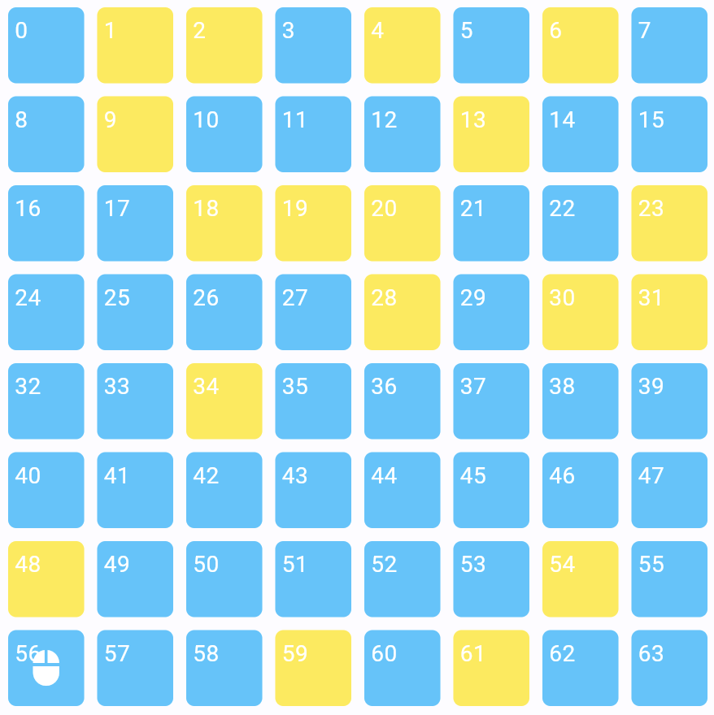
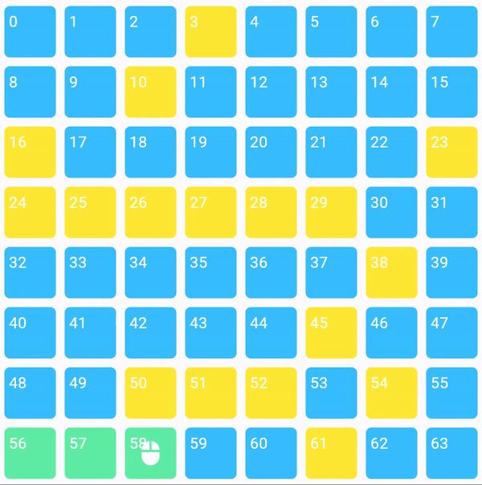

# Roomba - The robot's intelligence.

## What is Roomba?

Roomba is a term that refers to a series of autonomous robotic vacuum cleaners made by the company iRobot, and was first introduced in September 2002. Roombas have a set of sensors used to help them navigate the floor area of a home. Roomba robotic vacuum cleaners have become popular household appliances, offering convenience and efficiency in maintaining clean floors with minimal effort from the user.

## What exactly a Roomba does?

Roomba is an autonomous vacuum and one of the most popular consumer robots in existence. It navigates around clutter and under furniture cleaning your floors, and returns to its charging dock when finished.

## How is this project related to Roomba?

This project showcases how a Roomba-like robot operates, mimicking its movement to clean a dirty floor. It's built using Flutter and employs algorithms to replicate the navigation patterns of a Roomba vacuum cleaner

## How it works?

We have the below input

* Grid Dimensions: 8x8 grid.

* Starting Position: Bottom-left corner, coordinates (8,1).

* Initial Roomba Position: Starting station (bottom-left corner).

* Final Roomba Position: Must return to the starting station.

* Initial Battery Charge: 1000 units.

* Initial Score: 0 points.

* Initial Dirty Tiles: 0 tiles.

* Battery Consumption and Scoring:

    * Each movement consumes 10 units of battery charge.
    *  Each movement looses 1 point.

Our goal is to create a program that mimics the Roomba's movement to effectively clean all the dirty tiles on the floor.

* When the program launches, trigger a function to randomly mark 18 tiles as dirty.

* The Roomba starts at its staring station and must navigate to clean all dirty tiles before returning to its starting point.

* It must accomplish this task within the constraints of its battery charge capacity.

* We need to develop a function that helps determine the nearest dirty tile to the Roomba's current position. This function will aid the Roomba in navigating efficiently.

## Actual Implementation

We have to first understand that an 8x8 grid will have 64 positions. In terms of array positions it will start from 0 and will go till 63. Also we have to understand that the roomba can move up, down, left or right. 

We have to create a funciton to randomly create 18 dirty tiles. `generateUniqueRandomNumbers`

Then we will create a function to calculate the shortest path from the dirty tile to the current position and store it in the map. This will help us to calculate the nearest path to the dirty tile from the current tile. 

For this we have create a function `makePaths`. 

* Step 1: Iterate `dirtyTiles`.
* Step 2: Create a list `tempPath` to store the path from `currentIndex` tile to the `dirtyTiles`. 
* Step 3: Add the `currentIndex` in the `tempPath`.
* Step 4: Check if the `dirtyTiles` index is less than `currentIndex`, in this case we will either move left or upwards. Else if `dirtyTiles`index is greater than `currentIndex`, we will move right or downwards. 
* Step 5: Get the differece between `dirtyTiles` index and `currentIndex`. 
* Step 6: Divide the difference by 8 (as we have 8x8 grid) and get the `quotient` and `remainder`.
* Step 7: Now if `quotient` is greater than 0, increment/decrement the last element from `tempPath` and add to temp path depending on if you are moving up/down. 
* Step 8: If the `remainder` is greater than 0, use the method `checkIfSameLineOrMoveUp` or `checkIfSameLineOrMoveUp` to check if the `dirtyTiles` is on same line or next/below line and then add the indexes from last `tempPath` to the `currentIndex`. 
* Step 9: Add the `tempPath` to the `route` map with `dirtyTiles` index as key. 
* Step 10: Iterate the map to find the shortest length of the `tempPath` and then iterate the `tempPath` adding the indexes to `paths`. On every iteration, change the `tempPath[i]` to `currentIndex`. 
* Step 11: After successful iteration, remove the `currentIndex` from the `dirtyTiles`. 
* Step 12: Repeat the same process until no `dirtyTiles` left.
* Step 13: Now that we want to return to orgin, add origin to our `dirtyTiles` list and iterate the same process for the last time. 
* Step 14: In Step 10, decrease the battery by 10 and score by 1. 
* Step 15: In Step 11, increment the score by 10.

The final output will be saved in the `path`. This is the actual path that roomba will follow to clear all dirty tiles and return back to origin. 

On the UI side, create an 8x8 grid. For displaying the each tile, check if grid index exists `dirtyTiles`, if yes render it in yellow color. Now again if the grid index exists in the `paths`, render it using green color, else render it using blue color.

To be more precise, we add the `tempPath` and the `currentIndex` in `logs` and display it in a list so that we can track our path.

That's it folks! We're done with all the coding. Just go ahead and run your app!

Fantastic!! You have just learned how to create a Roomba in flutter.

## Important:

This repository is only for providing information on Roomba Robot. Please do not misuse it.

## Author:

* [Amit Mishra](https://github.com/amitmishra7)

If you like this tutorial please don't forget to add a **Star**. Also follow to get informed for upcoming tutorials.
